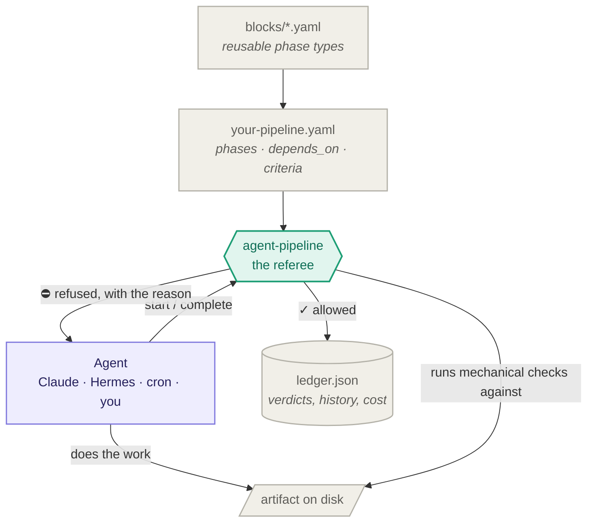
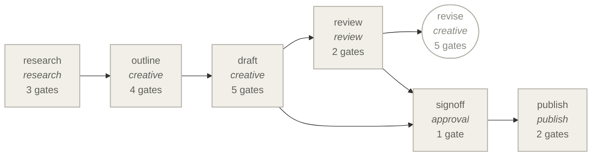
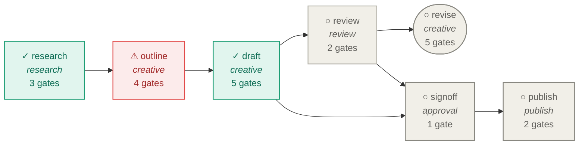

<div align="center">

# agent-pipeline

**A flexible pipeline engine for any task you need.**

Define a pipeline once, in YAML. Point any agent at it — Claude, Hermes, a cron job, yourself.<br/>
The engine decides what may start, what may finish, and what has gone stale.<br/>
It doesn't do the work, and doesn't care who does.

[Concepts](docs/01-concepts.md) · [Writing a pipeline](docs/02-writing-a-pipeline.md) · [Adding a block](docs/03-adding-a-block.md) · [Criteria](docs/04-criteria.md) · [Enforcement](docs/05-enforcement.md) · [AGENTS.md](AGENTS.md)

</div>

---

## The problem

Agents skip steps.

Not deliberately — a step described in prose forty thousand tokens ago is a step that quietly stops existing. Long runs drift. Cron runs drift worse, because nobody is watching. And the failure is invisible: every phase reports done, every artifact exists, and the thing that shipped was built on an input that moved three hours earlier.

Sterner instructions don't fix this. Instructions are the thing that decayed.

What survives is structure:

- a phase whose input doesn't exist **cannot run**
- a check executed by the engine **cannot be forgotten by the agent**
- a claim is not a verdict — **nothing completes on someone's say-so**

## How it works



The agent does the work and holds the context. The engine only ever answers three questions — *may this start*, *may this close*, *has anything gone stale* — and when the answer is no, it says exactly why.

Four things refuse a phase, in this order:

| # | Refusal | Because |
|---|---|---|
| 1 | dependencies incomplete | you can't draft from research that doesn't exist |
| 2 | artifact missing or empty | a 0-byte file is not a completed phase |
| 3 | a mechanical check failed | the engine ran it — your opinion isn't consulted |
| 4 | a judged/human criterion is unanswered, or failed | "I checked" is not a check |

## A pipeline

Because blocks carry the craft rules, the pipeline file carries only the sequence:

```yaml
name: blog-post
mode: referee
workdir: runs/{run}

phases:
  - id: research
    block: research

  - id: outline
    block: creative
    depends_on: [research]
    disable: [has-turn]          # an outline has no turn yet

  - id: draft
    block: creative
    depends_on: [outline]

  - id: review
    block: review
    depends_on: [draft]

  - id: revise
    block: creative
    depends_on: [review]
    optional: true

  - id: signoff
    block: approval
    depends_on: [draft, review]

  - id: publish
    block: publish
    depends_on: [signoff]
```

## See it

```bash
agent-pipeline graph
```

Emitted from the same YAML the engine executes, so a diagram in your README can't drift from the pipeline it describes:



Rounded nodes are optional phases. Now add `--status` and the same graph shows the actual run:

```bash
agent-pipeline graph --status
```



**Green** done · **red** stale — complete, but built on an input that has since moved · **grey outline** blocked by an incomplete dependency.

`--format dot` gives Graphviz if you want an SVG. `--fence` wraps the output in a ` ```mermaid ` block, so you can pipe it straight into a markdown file.

Or in the terminal:

```bash
agent-pipeline status
```
```
  blog-post  ·  run=2026-08-27  ·  mode=referee  ·  v1
  ──────────────────────────────────────────────────────────────────────────
  ✓  research                   Research                     2026-08-27 14:59  [research]
  ⚠  outline                    Outline                      STALE — upstream moved
  ✓  draft                      Draft                        2026-08-27 15:00  [creative]
  ○  signoff                    Sign-off                       [approval]
  ──────────────────────────────────────────────────────────────────────────
  4/6 required phases complete
```

## Install

```bash
pip install git+https://github.com/Oxde/Agent-Pipeline.git
```

That installs the `agent-pipeline` command with the built-in blocks and checks
bundled inside the package, so it works from any directory. One dependency: PyYAML.

Working on the engine itself:

```bash
git clone https://github.com/Oxde/Agent-Pipeline.git && cd Agent-Pipeline
pip install -e .
python3 -m unittest discover -s tests                 # 25 tests, all generic
```

## Use it

```bash
agent-pipeline init my-pipeline     # scaffold pipelines/my-pipeline.yaml
agent-pipeline validate             # costs nothing, catches everything structural
agent-pipeline blocks               # what phase types are available

agent-pipeline status               # where the run actually is
agent-pipeline guide draft          # what to do, and what will be checked
agent-pipeline start draft          # refuses if outline isn't done
#   ... do the work, write the artifact ...
agent-pipeline complete draft       # runs every gate
```

Unattended, from cron:

```bash
agent-pipeline --pipeline pipelines/daily-post.yaml --run $(date +%F) run
```

## Two modes, one definition

**`referee`** — an agent walks the pipeline holding the whole scope in its head, and the engine only refuses bad transitions. Use this when coherence is the product: a long piece whose ending has to answer its opening, where slicing the work into isolated steps is precisely what breaks it.

**`runner`** — the engine holds the loop and calls each phase's `run` command. Use this when nobody is watching. An agent invoked this way *cannot* skip a step, because it never decides what comes next.

Same YAML. One key.

## Blocks

A **block** is a reusable phase type — the parts of a step that are identical everywhere it appears: the artifact shape, the criteria, whether it iterates, and the guidance handed to whoever does the work.

| Block | For |
|---|---|
| `creative` | work that is judged, not measured — writing, scripts, design directions |
| `research` | finding out what is true before anything is built on it |
| `review` | an adversarial pass whose job is to find what is wrong |
| `approval` | a deliberate stop; a person decides, and the decision is recorded |
| `generate` | a phase that spends money on an external provider |
| `publish` | the irreversible one |

Drop your own into `<project>/blocks/` and they load alongside the built-ins — reuse a built-in's `id` and yours shadows it. No registration.

→ **[How to add a block](docs/03-adding-a-block.md)**

## Criteria

Every gate is a named criterion, and its **kind** decides who is allowed to satisfy it. That distinction is the entire anti-skipping mechanism.

| Kind | Satisfied by | Can it be asserted? |
|---|---|---|
| `mechanical` | a command the **engine** runs itself, every time | never |
| `judged` | a model answering a question | only with evidence |
| `human` | a person deciding | only by a person |

```yaml
criteria:
  - id: sources
    kind: mechanical
    description: At least three sources are cited.
    run: python3 {engine}/checks/contains.py {artifact} --pattern https?:// --min 3

  - id: has-turn
    kind: judged
    description: Something changes — an expectation is set and then overturned.
    ask: >
      Quote the line where the reader's expectation is overturned. If the piece
      only accumulates and never turns, answer FAIL.
```

Try to wave a mechanical criterion through:

```console
$ agent-pipeline judge research sources --status pass --evidence "trust me"
  'sources' is a mechanical criterion — it is run by the engine and cannot be asserted.
```

Try to pass a judgement on vibes:

```console
$ agent-pipeline judge draft has-turn --status pass
  a passing verdict needs --evidence. 'It looks fine' is not a record.
```

Write a stub so the file exists:

```console
$ agent-pipeline complete research
  ⛔ cannot complete 'research'
  ✗ [criterion-failed] [no-placeholders] No TODO / TBD left in the notes.
      → line 3: TODO — TODO: fill this in later
  ✗ [criterion-failed] [sources] At least three sources are cited.
      → research.md: found 0 match(es) for sources, need at least 3
```

The failure mode of judged criteria is that everything passes, and that happens when the question can be answered with an adjective. Demand a quote, a name, or a number — [docs/04-criteria.md](docs/04-criteria.md).

## Staleness

A phase is stale when its artifact is **older than something it depends on**. Nothing is missing. Nothing failed. Everything is green, and the output was built from a version of its input that no longer exists.

```console
$ agent-pipeline ship
  ⛔ 'blog-post' is NOT shippable
  ✗ [phase-stale] 'outline' completed, but its artifact predates: research.
      → reopen outline --reason 'upstream changed'
```

`ship` refuses on stale, not only on incomplete. Existence was never the right question.

## Reopening is surgical

Because dependencies are declared, reopening invalidates **only what genuinely depends on the change**:

```console
$ agent-pipeline reopen review --reason "second reviewer found the sample-size hole"
  reopened: review
  untouched (not downstream): research, outline, draft
```

Every reopened attempt is archived with its verdicts and the iteration counter bumps. Nothing is destroyed — the reason a rewrite worked is usually only visible against the thing it replaced.

## Making it unskippable

The engine refuses transitions. An agent that never calls the engine hasn't been refused anything — it simply didn't ask. Two fixes, in order of strength:

**Make the next step physically unable to run.** Not a rule — physics. If assembly takes the previous artifact as an argument, a missing upstream is a crash, not an oversight. No enforcement layer involved, nothing to remember.

**Put the check outside the worker.** A Claude Code `Stop` hook running `agent-pipeline ship` turns *the agent remembered to verify* into *the session cannot end unverified*. And cron should invoke the runner, never the agent:

```cron
# wrong — the agent holds the loop, so it can skip
0 9 * * *  claude -p "run the daily post pipeline"

# right — the engine holds the loop; the agent is a subroutine
0 9 * * *  agent-pipeline --pipeline pipelines/daily-post.yaml --run $(date +\%F) run
```

→ **[docs/05-enforcement.md](docs/05-enforcement.md)**

## Use it from an agent

The repo ships a skill at [`skills/agent-pipeline/SKILL.md`](skills/agent-pipeline/SKILL.md).
Point your agent at it and the loop, the verdict rules, and the refusal table
load on their own whenever a pipeline is in play.

```bash
# Claude Code
ln -s "$PWD/skills/agent-pipeline" ~/.claude/skills/agent-pipeline
# or per project
ln -s "$PWD/skills/agent-pipeline" <project>/.claude/skills/agent-pipeline
```

[AGENTS.md](AGENTS.md) is the longer version, for handing to an agent directly.

## Exit codes

Built for hooks and cron, so any shell can gate on them:

| Code | Meaning |
|---|---|
| `0` | allowed / clean |
| `1` | refused — a gate said no |
| `2` | the request was wrong — unknown phase, bad spec, missing file |

`1` is the system working. `2` is something misconfigured. Handle them differently.

## Layout

```
agent_pipeline/    the installable package — domain-agnostic, all of it
  spec.py          load + validate pipelines and blocks — spends nothing
  ledger.py        run state: phase entries and recorded verdicts
  gates.py         the referee: what may open, what may close, what is stale
  runner.py        runner mode, where the engine owns the loop
  status.py        the plain-text view
  graph.py         mermaid / dot rendering
  cli.py           the CLI
  blocks/          reusable phase types      ] bundled with the package so a
  checks/          generic mechanical checks ] pip install is self-contained
skills/            an agent skill — drop into .claude/skills/ or agentskills.io
examples/          worked pipelines in both modes
docs/              concepts · pipelines · blocks · criteria · enforcement
tests/             25 tests, no domain knowledge
```

**The rule that keeps this useful: `agent_pipeline/` stays domain-agnostic.** Anything that knows about your work goes in a pipeline or a block, never in the engine. If you're editing `engine/` to make your pipeline work, the pipeline is wrong.

## Licence

MIT.
